# Bukidnon Cable & Internet Services (BCIS) — Entity-Relationship Diagram & Database Catalog

This document specifies the complete relational schema and architecture for the **BCIS Subscription Billing and Collection System**. The schema is implemented on **PostgreSQL 16+** using **Drizzle ORM** with strict integer centavo financial arithmetic (`BIGINT`), multi-zone `TIMESTAMPTZ` handling (`Asia/Manila`, UTC+08:00), and comprehensive referential integrity.

---

## 1. Core Architecture & Financial Invariants

1. **Integer Centavo Representation**: All monetary columns (`*_centavos`) are stored as `BIGINT` (1 PHP = 100 Centavos). No floating-point data types (`FLOAT`, `DOUBLE PRECISION`) are permitted in financial paths.
2. **Non-Destructive Financial Ledger**: Payments, invoices, and ledger entries cannot be hard-deleted. Corrections are executed through strictly audited reversal and adjustment transactions (`payment_reversals`, credit/debit entries in `subscriber_ledger`).
3. **Duplicate Billing Prevention (AT-11)**: A partial composite unique index `unique_active_invoice_per_period` enforces that no service account can have more than one non-void invoice for the same `(billing_period_start, billing_period_end)`.
4. **Receipt Numbering & Advisory Locking**: Official Receipt (OR) numbers (`OR-YYYYMM-XXXX`) and batch numbers are serialized within transaction-scoped advisory locks (`pg_advisory_xact_lock`) to prevent sequence gaps and race conditions under multi-workstation concurrency.
5. **Timezone Standardization**: All audit and transaction timestamps are stored with timezone (`TIMESTAMPTZ`), defaulting to UTC at rest and interpreted within `Asia/Manila` (UTC+08:00) for daily shift bounds and billing cycles.

---

## 2. Complete Mermaid Entity-Relationship Diagram

```mermaid
erDiagram
    %% ==========================================
    %% 1. Access Control & Users
    %% ==========================================
    USERS {
        uuid id PK
        varchar username UK
        varchar password_hash
        varchar full_name
        varchar email
        boolean is_active
        integer failed_login_attempts
        timestamptz locked_until
        timestamptz created_at
        timestamptz updated_at
    }

    ROLES {
        uuid id PK
        varchar code UK
        varchar name
        text description
        timestamptz created_at
    }

    PERMISSIONS {
        uuid id PK
        varchar code UK
        varchar module
        text description
        varchar risk_level
    }

    ROLE_PERMISSIONS {
        uuid role_id PK, FK
        uuid permission_id PK, FK
    }

    USER_ROLES {
        uuid user_id PK, FK
        uuid role_id PK, FK
        timestamptz assigned_at
    }

    %% ==========================================
    %% 2. Subscribers & Geographics
    %% ==========================================
    SUBSCRIBERS {
        uuid id PK
        varchar account_number UK
        varchar first_name
        varchar middle_name
        varchar last_name
        varchar business_name
        varchar contact_number
        varchar alternate_contact
        varchar email
        varchar id_type
        varchar id_number
        bigint advance_credit_centavos
        varchar status
        text notes
        timestamptz created_at
        timestamptz updated_at
    }

    SUBSCRIBER_ADDRESSES {
        uuid id PK
        uuid subscriber_id FK
        varchar address_type
        text street_address
        varchar barangay
        varchar municipality
        varchar province
        varchar postal_code
        numeric latitude
        numeric longitude
        boolean is_primary
    }

    %% ==========================================
    %% 3. Catalog & Service Accounts
    %% ==========================================
    SERVICE_TYPES {
        uuid id PK
        varchar code UK
        varchar name
    }

    SERVICE_PLANS {
        uuid id PK
        uuid service_type_id FK
        varchar plan_code UK
        varchar name
        bigint monthly_recurring_centavos
        bigint installation_fee_centavos
        integer bandwidth_mbps
        integer channel_count
        boolean is_active
        timestamptz created_at
    }

    SERVICE_ACCOUNTS {
        uuid id PK
        varchar service_account_number UK
        uuid subscriber_id FK
        uuid service_plan_id FK
        uuid installation_address_id FK
        uuid collector_id FK
        uuid collection_area_id FK
        uuid collection_route_id FK
        integer billing_day_of_month
        bigint current_rate_centavos
        varchar status
        date activation_date
        timestamptz created_at
        timestamptz updated_at
    }

    %% ==========================================
    %% 4. Billing & Invoicing
    %% ==========================================
    INVOICES {
        uuid id PK
        varchar invoice_number UK
        uuid service_account_id FK
        uuid subscriber_id FK
        date billing_period_start
        date billing_period_end
        date issue_date
        date due_date
        bigint subtotal_centavos
        bigint vat_centavos
        bigint total_due_centavos
        bigint allocated_centavos
        bigint remaining_balance_centavos
        varchar status
        text notes
        timestamptz created_at
        timestamptz updated_at
    }

    INVOICE_ITEMS {
        uuid id PK
        uuid invoice_id FK
        varchar item_type
        varchar description
        bigint amount_centavos
        integer quantity
    }

    %% ==========================================
    %% 5. Payments, Receipts & Reversals
    %% ==========================================
    PAYMENTS {
        uuid id PK
        varchar payment_number UK
        uuid subscriber_id FK
        uuid cashier_id FK
        timestamptz payment_date
        varchar payment_method
        varchar reference_number
        bigint amount_centavos
        boolean is_reversed
        text notes
        timestamptz created_at
    }

    PAYMENT_ALLOCATIONS {
        uuid id PK
        uuid payment_id FK
        uuid invoice_id FK
        bigint allocated_centavos
        timestamptz created_at
    }

    RECEIPTS {
        uuid id PK
        varchar receipt_number UK
        uuid payment_id UK, FK
        uuid cashier_id FK
        bigint total_amount_centavos
        varchar status
        timestamptz issued_at
    }

    PAYMENT_REVERSALS {
        uuid id PK
        uuid payment_id UK, FK
        uuid reversed_by FK
        text reason
        timestamptz reversal_date
    }

    GCASH_TRANSACTIONS {
        uuid id PK
        varchar reference_number UK
        uuid subscriber_id FK
        varchar sender_name
        varchar sender_phone
        bigint amount_centavos
        text proof_image_path
        varchar status
        uuid verified_by FK
        timestamptz verified_at
        text rejection_reason
        timestamptz created_at
    }

    %% ==========================================
    %% 6. Running Ledger
    %% ==========================================
    SUBSCRIBER_LEDGER {
        uuid id PK
        uuid subscriber_id FK
        timestamptz entry_date
        varchar entry_type
        varchar reference_id
        varchar description
        bigint debit_centavos
        bigint credit_centavos
        bigint balance_after_centavos
        timestamptz created_at
    }

    %% ==========================================
    %% 7. Field Collections & Routes
    %% ==========================================
    COLLECTION_AREAS {
        uuid id PK
        varchar name UK
        varchar code UK
        text description
        varchar barangay
        varchar city
        uuid assigned_collector_id FK
        boolean is_active
        timestamptz created_at
        timestamptz updated_at
    }

    COLLECTION_ROUTES {
        uuid id PK
        uuid collection_area_id FK
        varchar route_code UK
        varchar name
        text description
        uuid assigned_collector_id FK
        boolean is_active
        timestamptz created_at
        timestamptz updated_at
    }

    COLLECTION_BATCHES {
        uuid id PK
        varchar batch_number UK
        uuid collector_id FK
        uuid collection_area_id FK
        varchar status
        bigint expected_cash_centavos
        bigint remitted_cash_centavos
        bigint difference_centavos
        timestamptz opened_at
        timestamptz closed_at
    }

    %% ==========================================
    %% 8. Service Orders (Provisioning & Field)
    %% ==========================================
    SERVICE_ORDERS {
        uuid id PK
        varchar order_number UK
        varchar order_type
        varchar status
        uuid service_account_id FK
        uuid subscriber_id FK
        uuid assigned_technician_id FK
        varchar priority
        date scheduled_date
        timestamptz completed_at
        timestamptz cancelled_at
        text cancellation_reason
        uuid target_address_id FK
        text description
        text resolution_notes
        jsonb materials_used
        bigint fee_centavos
        varchar disconnection_type
        timestamptz created_at
        timestamptz updated_at
    }

    %% ==========================================
    %% 9. Dunning Management & Audit
    %% ==========================================
    DUNNING_NOTICES {
        uuid id PK
        varchar notice_number UK
        uuid service_account_id FK
        uuid subscriber_id FK
        integer notice_level
        varchar status
        bigint overdue_balance_centavos
        integer days_overdue
        date oldest_invoice_due_date
        timestamptz issued_at
        uuid issued_by FK
        timestamptz delivered_at
        uuid delivered_by FK
        text delivery_notes
        timestamptz resolved_at
        text resolved_reason
        text notes
        timestamptz created_at
        timestamptz updated_at
    }

    AUDIT_LOGS {
        uuid id PK
        uuid actor_id FK
        varchar actor_name
        varchar action
        varchar entity_type
        varchar entity_id
        jsonb old_values
        jsonb new_values
        text reason
        varchar ip_address
        timestamptz created_at
    }

    %% ==========================================
    %% Cardinalities & Relationships
    %% ==========================================
    USERS ||--o{ USER_ROLES : "assigned via"
    ROLES ||--o{ USER_ROLES : "granted in"
    ROLES ||--o{ ROLE_PERMISSIONS : "includes"
    PERMISSIONS ||--o{ ROLE_PERMISSIONS : "granted to"

    SUBSCRIBERS ||--o{ SUBSCRIBER_ADDRESSES : "maintains"
    SUBSCRIBERS ||--o{ SERVICE_ACCOUNTS : "holds"
    SUBSCRIBERS ||--o{ INVOICES : "billed via"
    SUBSCRIBERS ||--o{ PAYMENTS : "remits"
    SUBSCRIBERS ||--o{ SUBSCRIBER_LEDGER : "audited by"
    SUBSCRIBERS ||--o{ GCASH_TRANSACTIONS : "submits"
    SUBSCRIBERS ||--o{ SERVICE_ORDERS : "requests"
    SUBSCRIBERS ||--o{ DUNNING_NOTICES : "notified by"

    SERVICE_TYPES ||--o{ SERVICE_PLANS : "classifies"
    SERVICE_PLANS ||--o{ SERVICE_ACCOUNTS : "subscribes"
    SUBSCRIBER_ADDRESSES ||--o{ SERVICE_ACCOUNTS : "installs at"

    COLLECTION_AREAS ||--o{ COLLECTION_ROUTES : "partitions"
    COLLECTION_AREAS ||--o{ SERVICE_ACCOUNTS : "locates"
    COLLECTION_ROUTES ||--o{ SERVICE_ACCOUNTS : "sequences"
    COLLECTION_AREAS ||--o{ COLLECTION_BATCHES : "covers"

    USERS ||--o{ SERVICE_ACCOUNTS : "assigned collector"
    USERS ||--o{ COLLECTION_AREAS : "assigned supervisor"
    USERS ||--o{ COLLECTION_ROUTES : "assigned collector"
    USERS ||--o{ COLLECTION_BATCHES : "conducts batch"
    USERS ||--o{ PAYMENTS : "cashier receives"
    USERS ||--o{ RECEIPTS : "cashier issues"
    USERS ||--o{ PAYMENT_REVERSALS : "admin authorizes"
    USERS ||--o{ GCASH_TRANSACTIONS : "cashier verifies"
    USERS ||--o{ SERVICE_ORDERS : "tech executes"
    USERS ||--o{ DUNNING_NOTICES : "delivers notice"
    USERS ||--o{ AUDIT_LOGS : "acts in"

    SERVICE_ACCOUNTS ||--o{ INVOICES : "generates"
    SERVICE_ACCOUNTS ||--o{ SERVICE_ORDERS : "subject to"
    SERVICE_ACCOUNTS ||--o{ DUNNING_NOTICES : "flagged for"

    INVOICES ||--|{ INVOICE_ITEMS : "contains"
    INVOICES ||--o{ PAYMENT_ALLOCATIONS : "settled by"
    PAYMENTS ||--o{ PAYMENT_ALLOCATIONS : "allocates into"

    PAYMENTS ||--o| RECEIPTS : "issues OR"
    PAYMENTS ||--o| PAYMENT_REVERSALS : "subject to reversal"
    SUBSCRIBER_ADDRESSES ||--o{ SERVICE_ORDERS : "target location"
```

---

## 3. Relational Table Dictionary & Constraint Matrix

### 3.1 Security & Role-Based Access Control (RBAC)
| Table | Primary Key | Foreign Keys | Unique Constraints & Indices | Purpose |
| :--- | :--- | :--- | :--- | :--- |
| `users` | `id` (UUID) | None | `username` (UNIQUE) | System users (cashiers, collectors, accountants, admin) with lockout guards. |
| `roles` | `id` (UUID) | None | `code` (UNIQUE) | Canonical operational roles (`ROLE_ADMIN`, `ROLE_CASHIER`, etc.). |
| `permissions` | `id` (UUID) | None | `code` (UNIQUE) | Granular action permissions with risk levels (`Low`, `Medium`, `High`, `Critical`). |
| `role_permissions` | `(role_id, permission_id)` | `role_id` -> `roles(id)` (CASCADE) `permission_id` -> `permissions(id)` (CASCADE) | Primary Key composite | Junction mapping operational permissions to roles. |
| `user_roles` | `(user_id, role_id)` | `user_id` -> `users(id)` (CASCADE) `role_id` -> `roles(id)` (CASCADE) | Primary Key composite | Junction assigning roles to users. |

### 3.2 Subscriber Master & Geographic Hierarchy
| Table | Primary Key | Foreign Keys | Unique Constraints & Indices | Purpose |
| :--- | :--- | :--- | :--- | :--- |
| `subscribers` | `id` (UUID) | None | `account_number` (UNIQUE) | Core customer entity holding `advance_credit_centavos` and status lifecycle. |
| `subscriber_addresses` | `id` (UUID) | `subscriber_id` -> `subscribers(id)` (CASCADE) | `idx_subscriber_addresses_barangay` | Billing and installation physical coordinates (Barangay, Lat/Long). |
| `collection_areas` | `id` (UUID) | `assigned_collector_id` -> `users(id)` | `name` (UNIQUE), `code` (UNIQUE) | Operational collection zones (e.g., Casisang, Sumpong, Poblacion). |
| `collection_routes` | `id` (UUID) | `collection_area_id` -> `collection_areas(id)` (CASCADE) `assigned_collector_id` -> `users(id)` | `route_code` (UNIQUE) | Granular street-by-street field collection routes for route sheets. |

### 3.3 Plans & Service Accounts
| Table | Primary Key | Foreign Keys | Unique Constraints & Indices | Purpose |
| :--- | :--- | :--- | :--- | :--- |
| `service_types` | `id` (UUID) | None | `code` (UNIQUE) | Service categories: `INTERNET`, `CABLE_TV`, `COMBO`. |
| `service_plans` | `id` (UUID) | `service_type_id` -> `service_types(id)` | `plan_code` (UNIQUE) | Monthly recurring tariffs and bandwidth/channel parameters. |
| `service_accounts` | `id` (UUID) | `subscriber_id` -> `subscribers(id)` (RESTRICT) `service_plan_id` -> `service_plans(id)` (RESTRICT) `installation_address_id` -> `subscriber_addresses(id)` `collector_id` -> `users(id)` `collection_area_id` -> `collection_areas(id)` `collection_route_id` -> `collection_routes(id)` | `service_account_number` (UNIQUE) | Specific provisioned service contract tied to a physical location and route. |

### 3.4 Invoicing & Line Items
| Table | Primary Key | Foreign Keys | Unique Constraints & Indices | Purpose |
| :--- | :--- | :--- | :--- | :--- |
| `invoices` | `id` (UUID) | `service_account_id` -> `service_accounts(id)` (RESTRICT) `subscriber_id` -> `subscribers(id)` (RESTRICT) | `invoice_number` (UNIQUE) `unique_active_invoice_per_period` on `(service_account_id, billing_period_start, billing_period_end)` WHERE `status != 'VOID'` | Monthly bills with due dates, VAT breakdown, remaining balance, and status. |
| `invoice_items` | `id` (UUID) | `invoice_id` -> `invoices(id)` (CASCADE) | None | Itemized plan fees, proration, reconnection fees, or hardware amortizations. |

### 3.5 Payments, Receipts, and Online Verifications
| Table | Primary Key | Foreign Keys | Unique Constraints & Indices | Purpose |
| :--- | :--- | :--- | :--- | :--- |
| `payments` | `id` (UUID) | `subscriber_id` -> `subscribers(id)` (RESTRICT) `cashier_id` -> `users(id)` | `payment_number` (UNIQUE) | Tender collection record (CASH, GCASH, CHECK, BANK_TRANSFER). |
| `payment_allocations`| `id` (UUID) | `payment_id` -> `payments(id)` (RESTRICT) `invoice_id` -> `invoices(id)` (RESTRICT) | `idx_payment_allocations_payment`, `idx_payment_allocations_invoice` | FIFO liquidation matrix linking payments to specific open invoices. |
| `receipts` | `id` (UUID) | `payment_id` -> `payments(id)` (RESTRICT, UNIQUE) `cashier_id` -> `users(id)` | `receipt_number` (UNIQUE) | Sequential BIR Official Receipts (`OR-YYYYMM-XXXX`) with 12% VAT calculations. |
| `payment_reversals` | `id` (UUID) | `payment_id` -> `payments(id)` (RESTRICT, UNIQUE) `reversed_by` -> `users(id)` | `payment_id` (UNIQUE) | Audited reversal record releasing applied invoice balances and deducting credits. |
| `gcash_transactions`| `id` (UUID) | `subscriber_id` -> `subscribers(id)` `verified_by` -> `users(id)` | `reference_number` (UNIQUE) | Online remittance queue preventing duplicate reference numbers (AT-05). |

### 3.6 Financial Ledger & Operational Field Modules
| Table | Primary Key | Foreign Keys | Unique Constraints & Indices | Purpose |
| :--- | :--- | :--- | :--- | :--- |
| `subscriber_ledger` | `id` (UUID) | `subscriber_id` -> `subscribers(id)` (RESTRICT) | `idx_subscriber_ledger_sub_date` | Chronological debits, credits, and running balance per subscriber. |
| `collection_batches`| `id` (UUID) | `collector_id` -> `users(id)` `collection_area_id` -> `collection_areas(id)` | `batch_number` (UNIQUE) | Daily field remittance envelopes comparing expected cash vs. turned-in cash. |
| `service_orders` | `id` (UUID) | `service_account_id` -> `service_accounts(id)` (RESTRICT) `subscriber_id` -> `subscribers(id)` (RESTRICT) `assigned_technician_id` -> `users(id)` `target_address_id` -> `subscriber_addresses(id)` | `order_number` (UNIQUE) | Technical dispatch lifecycle (`PENDING` -> `ASSIGNED` -> `IN_PROGRESS` -> `COMPLETED`). |
| `dunning_notices` | `id` (UUID) | `service_account_id` -> `service_accounts(id)` (CASCADE) `subscriber_id` -> `subscribers(id)` (CASCADE) `issued_by` -> `users(id)` `delivered_by` -> `users(id)` | `notice_number` (UNIQUE) | Multi-stage collection demand letters (First Notice, Final Notice, Disconnection Notice). |
| `audit_logs` | `id` (UUID) | `actor_id` -> `users(id)` | `idx_audit_logs_action`, `idx_audit_logs_entity`, `idx_audit_logs_date` | Immutable forensic audit log tracking all operational and financial mutations. |

---

## 4. Key Integrity & Concurrency Rules

1. **Foreign Key Deletion Guardrails**: `subscribers`, `service_accounts`, `invoices`, and `payments` enforce `ON DELETE RESTRICT` to prevent orphaned financial history.
2. **Advisory Locking Hash Keys**:
   - `receipt_numbering_<YYYYMM>`: Serializes OR number generation.
   - `collection_batch_closing_<id>`: Eliminates race conditions during shift remittance closing.
   - `service_order_numbering`: Guarantees sequential order numbers across concurrent technician workstations.
3. **FIFO Allocation Transaction Atomicity**: Payment processing executes within a single `db.transaction()` block:
   - Locks subscriber advance credit via `SELECT ... FOR UPDATE`.
   - Locates oldest unpaid invoices (`ORDER BY due_date ASC`).
   - Inserts `payments`, `payment_allocations`, `receipts`, and `subscriber_ledger` atomically.
   - Converts surplus tender directly into `subscribers.advance_credit_centavos`.
