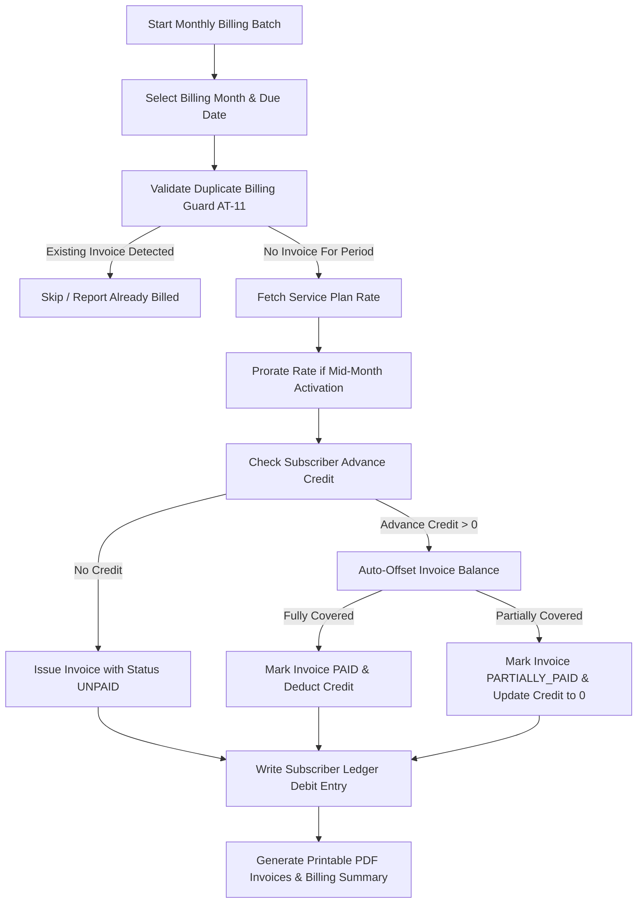
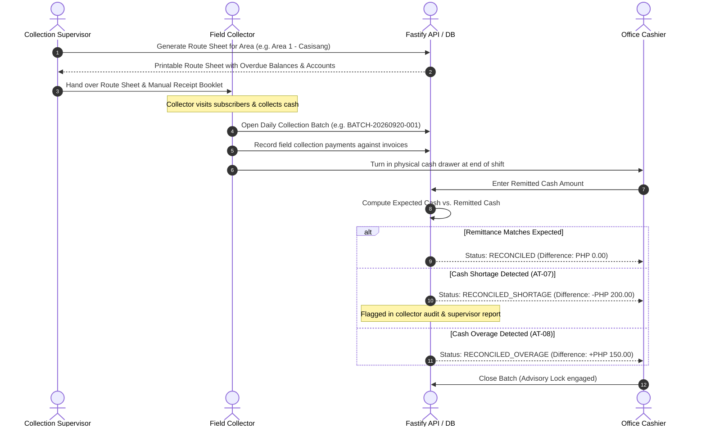
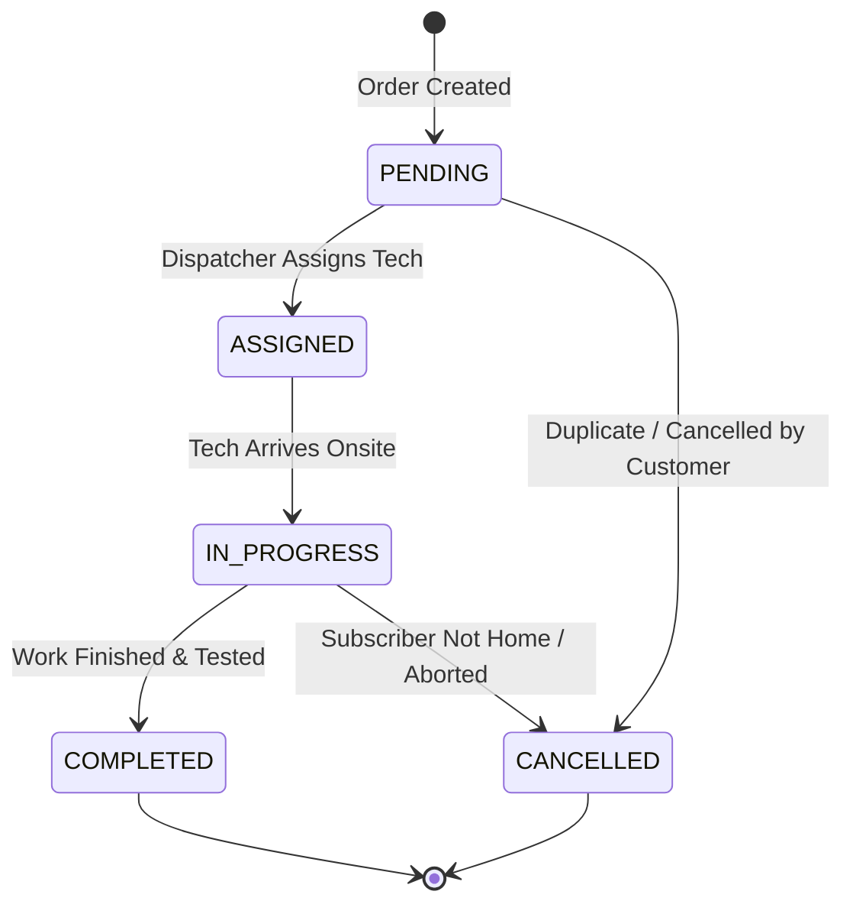

# Bukidnon Cable and Internet Services (BCIS)
# Operations & Staff User Manual

**Document Version**: 1.0.0  
**Target Audience**: System Administrators, Counter Cashiers, Field Collectors, Operations Technicians, and Accounting Personnel.  
**System Architecture**: Multi-Client Windows Desktop LAN Client (Electron/React) connected to Fastify API and PostgreSQL 16+.

---

## Table of Contents

1. [System Overview & Architecture](#1-system-overview--architecture)
2. [Global Keyboard Shortcuts & Navigation](#2-global-keyboard-shortcuts--navigation)
3. [Counter Cashier POS Guide](#3-counter-cashier-pos-guide)
4. [Monthly Billing Batch Generation](#4-monthly-billing-batch-generation)
5. [GCash Verification & Fraud Prevention Queue](#5-gcash-verification--fraud-prevention-queue)
6. [Field Collections, Route Sheets & Remittance Reconciliation](#6-field-collections-route-sheets--remittance-reconciliation)
7. [Service Orders & Field Technical Operations](#7-service-orders--field-technical-operations)
8. [Accounts Receivable Aging & Dunning Management](#8-accounts-receivable-aging--dunning-management)
9. [System Administration, Backups & Disaster Recovery](#9-system-administration-backups--disaster-recovery)
10. [Troubleshooting & Common Error Resolution](#10-troubleshooting--common-error-resolution)

---

## 1. System Overview & Architecture

The BCIS Subscription Billing and Collection System is designed for simultaneous multi-workstation operation over the office Local Area Network (LAN):

```text
  ┌────────────────────────────────────────────────────────┐
  │                 LOCAL AREA NETWORK (LAN)               │
  └─────────────┬────────────────────┬─────────────────────┘
                │                    │                     │
                ▼                    ▼                     ▼
        [Workstation 1]      [Workstation 2]       [Workstation 3]
          Owner / Admin       Counter Cashier       Operations / Tech
        (Admin Workspace)    (Cashier POS / OR)    (Service Orders)
                │                    │                     │
                └────────────────────┼─────────────────────┘
                                     ▼
                      Fastify API Server (Port 3001)
                                     │
                        PostgreSQL 16 Database
                   (Integer Centavos / Asia/Manila)
```

### Workstation Roles & Permissions
- **Admin (`ROLE_ADMIN`)**: Unrestricted administrative, financial, configuration, and backup management access.
- **Cashier (`ROLE_CASHIER`)**: Counter POS payment acceptance, official receipt issuance/reprinting, daily shift summary.
- **Accounting (`ROLE_ACCOUNTING`)**: Monthly billing batch runs, financial statements, AR aging reports, payment reversals, collector reconciliation.
- **Collection Supervisor (`ROLE_COLLECTION_SUPERVISOR`)**: Area assignment, route sheet generation, field remittance review, dunning notices.
- **Technician (`ROLE_TECHNICIAN`)**: Service order lifecycle management (installation, repair, disconnection, reconnection).

---

## 2. Global Keyboard Shortcuts & Navigation

The desktop application is optimized for mouse-free high-speed counter operations.

### Navigation Hotkeys
| Key Combination | Destination Workspace | Role Permission Required |
| :--- | :--- | :--- |
| `Ctrl + 1` | Dashboard / Metrics Overview | All Users |
| `Ctrl + 2` | Subscribers & Accounts Master | `subscribers.read` |
| `Ctrl + 3` | Counter Cashier POS & Receipts | `payments.create` |
| `Ctrl + 4` | Billing & Invoicing Engine | `billing.view` |
| `Ctrl + 5` | GCash Verification Queue | `payments.verify_gcash` |
| `Ctrl + 6` | Field Collections & Remittance | `collections.manage` |
| `Ctrl + 7` | Service Orders & Field Work | `service_orders.read` |
| `Ctrl + 8` | Reports & AR Aging Analytics | `reports.view` |
| `Ctrl + 9` | System Settings & Backup Vault | `system.manage` |

### Cashier POS Quick Action Keys
| Key | Function |
| :--- | :--- |
| `F1` | Focus Subscriber Search Input (auto-highlights existing text) |
| `F2` | Select Payment Method: **CASH** |
| `F3` | Select Payment Method: **GCASH** (prompts for 12-digit Ref #) |
| `F4` | Select Payment Method: **CHECK** or **BANK TRANSFER** |
| `F8` | View Subscriber Running Ledger & Statement of Account (SOA) |
| `F9` | Open Daily Cashier Collection Summary |
| `Ctrl + Enter` | Post Payment & Issue Official Receipt (Atomic Transaction) |
| `Ctrl + P` | Dispatch Print Command to 80mm ESC/POS Thermal Printer |
| `Esc` | Clear Current Form / Dismiss Active Modal Dialog |

---

## 3. Counter Cashier POS Guide

The Counter Cashier POS screen handles subscriber payments with automated First-In, First-Out (FIFO) invoice liquidation and excess advance credit handling.

```text
+-----------------------------------------------------------------------------------+
| BCIS CASHIER POS - TERMINAL: COUNTER-01                      CASHIER: Grace M.    |
+-----------------------------------------------------------------------------------+
| [F1] Search Subscriber: [ SUB-202609-0001 | Juan Dela Cruz                    ]   |
+-----------------------------------------------------------------------------------+
| SUBSCRIBER DETAILS:                                                               |
| Name: Juan Dela Cruz                   Current AR Balance: PHP 2,050.00           |
| Plan: Fiber Unlimited 50M              Advance Credit    : PHP     0.00           |
| Address: Purok 1, Casisang             Status            : ACTIVE                 |
+-----------------------------------------------------------------------------------+
| UNPAID INVOICES (FIFO SETTLEMENT ORDER):                                          |
| [X] INV-202609-000001   Due: 2026-09-20   Total: 1,500.00   Remaining: 1,500.00   |
| [X] INV-202609-000002   Due: 2026-09-20   Total:   550.00   Remaining:   550.00   |
+-----------------------------------------------------------------------------------+
| PAYMENT DETAILS:                                                                  |
| Payment Method: [ CASH (F2) ] [ GCASH (F3) ] [ CHECK (F4) ]                       |
| Amount Tendered: [ PHP 2,500.00          ]                                        |
|                                                                                   |
| Total Invoices Due : PHP 2,050.00                                                 |
| Invoices Allocated : PHP 2,050.00 (Both Invoices Marked PAID)                     |
| Advance Credit Added: PHP   450.00 (Surplus credited to subscriber account)      |
| Cashier Change     : PHP     0.00 (Exact tender applied / change returned)       |
+-----------------------------------------------------------------------------------+
| [ Ctrl+Enter: POST PAYMENT & ISSUE OR ]                         [ Esc: CANCEL ]   |
+-----------------------------------------------------------------------------------+
```

### Step-by-Step Counter Workflow:
1. **Search Subscriber (`F1`)**: Type account number (`SUB-...`), last name, or contact number. Press `Enter` to select.
2. **Review Open Invoices**: The system loads all unpaid and partially paid invoices sorted chronologically by `due_date ASC`.
3. **Select Tender Method (`F2`-`F4`)**:
   - **Cash**: Enter tendered bill denomination. If tendered exceeds due, specify whether surplus is returned as cash change or credited as advance balance.
   - **GCash**: Enter the 12-digit GCash Reference Number from the customer's phone SMS/app. The system immediately checks for reference uniqueness.
   - **Check**: Record bank name, check number, and maturity date.
4. **Post Payment (`Ctrl + Enter`)**:
   - Executes atomic transaction on Fastify API.
   - Applies payment to oldest invoices first (FIFO).
   - Generates sequential Official Receipt (`OR-YYYYMM-XXXX`).
   - Inserts audit record in `subscriber_ledger`.
5. **Print Official Receipt (`Ctrl + P`)**:
   - Thermal receipt preview modal opens automatically.
   - Prints 80mm ESC/POS layout with BIR VAT breakdown (12% VAT, VATable sales, non-VAT).
   - Auto-cutter separates paper upon completion.

---

## 4. Monthly Billing Batch Generation

Billing generation produces recurring monthly invoices across active subscriber service accounts.



### How to Run a Billing Batch:
1. Navigate to **Billing & Invoicing (`Ctrl + 4`)**.
2. Click **Generate Monthly Billing Batch**.
3. Select parameters:
   - **Billing Period**: e.g., `2026-10-01` to `2026-10-31`.
   - **Issue Date**: e.g., `2026-10-01`.
   - **Due Date**: e.g., `2026-10-20` (Standard 20-day payment term).
   - **Scope**: All Active Accounts, or filter by specific **Collection Area** (e.g., Casisang).
4. Click **Run Preview**: The system displays total accounts to bill, total projected billable revenue, and estimated advance credit offsets.
5. Click **Confirm & Execute**:
   - The server enforces the `unique_active_invoice_per_period` constraint, ensuring no subscriber is double-billed.
   - Generates invoice numbers formatted as `INV-YYYYMM-XXXXXX`.
   - Decrements `subscribers.advance_credit_centavos` for subscribers with prepayments.
   - Posts corresponding debit lines to `subscriber_ledger`.

---

## 5. GCash Verification & Fraud Prevention Queue

To prevent fraudulent or recycled payment claims, online GCash payments are placed in an isolated verification queue before posting to the financial ledger.

```text
+-----------------------------------------------------------------------------------+
| GCASH VERIFICATION QUEUE - PENDING REVIEW (3 items)                                |
+-----------------------------------------------------------------------------------+
| Ref Number    | Subscriber Name  | Amount (PHP) | Phone Number | Proof Image      |
| 102938475610  | Maria Santos     |     1,800.00 | 0918-123-4567| [View Image (O)] |
| 987654321098  | Antonio Luna     |     1,299.00 | 0920-987-6543| [View Image (O)] |
| 554433221100  | Roberto Gomez    |     2,499.00 | 0917-333-2211| [View Image (O)] |
+-----------------------------------------------------------------------------------+
```

### Verification Procedure:
1. Navigate to **GCash Queue (`Ctrl + 5`)**.
2. Click on a pending submission to open the verification lightbox.
3. Compare the mobile screenshot against BCIS Merchant SMS records:
   - Verify that **Reference Number** matches digit-for-digit.
   - Verify that **Amount** matches the received text alert.
   - Verify that **Timestamp** coincides with the reported remittance time.
4. **Action**:
   - **Approve & Post**: Automatically posts payment under payment method `GCASH`, issues Official Receipt, applies FIFO invoice settlement, and updates the transaction status to `VERIFIED`.
   - **Reject**: Prompts for required rejection reason (e.g., *“Invalid reference number; no corresponding transaction found on merchant phone”*). Sends SMS alert to subscriber.

---

## 6. Field Collections, Route Sheets & Remittance Reconciliation

For subscribers in residential barangays paying via authorized field collectors, the system enforces a strict physical chain of custody.



### Remittance Discrepancy Rules (AT-07 / AT-08):
- **Shortage**: If physical cash is less than logged receipts, the batch is closed as `RECONCILED_SHORTAGE`. A deduction ledger liability is generated against the collector. Shortages cannot be silently hidden.
- **Overage**: If physical cash exceeds logged receipts, the batch is closed as `RECONCILED_OVERAGE` with the difference booked into miscellaneous unallocated receipts pending investigation.

---

## 7. Service Orders & Field Technical Operations

Service Orders coordinate field dispatch for installations, repairs, suspensions, and reconnections.



### Service Order Types:
1. **INSTALLATION**: Provisions a new subscriber account from `PENDING_INSTALL` to `ACTIVE`.
2. **REPAIR**: Addresses signal degradation, optical loss, or cut fiber drops. Records materials used (e.g., 50m drop cable, 2 fast connectors).
3. **DISCONNECTION**: Triggered manually or via Dunning escalation for 60+ days overdue accounts. Transitions service account status to `SUSPENDED` or `TERMINATED`.
4. **RECONNECTION**: Restores service after settlement of outstanding balance and optional reconnection fee.

---

## 8. Accounts Receivable Aging & Dunning Management

The system groups outstanding receivables into 5 calendar buckets based on the invoice `due_date`:
1. **Current**: Invoices due in the future or on today's calendar date.
2. **1 - 30 Days Overdue**: First-stage delinquency (Account flagged).
3. **31 - 60 Days Overdue**: Second-stage delinquency (Level 1 Dunning Notice).
4. **61 - 90 Days Overdue**: Critical delinquency (Level 2 Final Demand Notice).
5. **90+ Days Overdue**: Severe default (Automatic Disconnection Candidate).

### Dunning Notice Escalation Workflow:
```text
  [Overdue 30 Days]  ──>  Issue Level 1 Notice (Friendly Reminder)
                                 │
  [Overdue 60 Days]  ──>  Issue Level 2 Notice (Final Notice to Pay within 5 days)
                                 │
  [Overdue 75+ Days] ──>  Generate DISCONNECTION Service Order (Tech dispatches)
```

### Exporting Reports:
1. Open **Reports (`Ctrl + 8`)**.
2. Choose from the export options:
   - **AR Aging Report**: Available grouped by `subscriber`, `service_account`, `barangay`, or `summary`.
   - **Daily Collection Summary**: Filterable by date and cashier; itemizes tender breakdowns.
   - **Delinquent Accounts List**: Lists all accounts exceeding custom day thresholds with collector details.
3. Select **Export Format**: `CSV` (RFC 4180 with spreadsheet formula injection protection) or `PDF`.

---

## 9. System Administration, Backups & Disaster Recovery

The BCIS database contains mission-critical financial and subscription records. Backups must be performed regularly.

### Creating an On-Demand Backup:
1. Navigate to **Settings & Vault (`Ctrl + 9`)**.
2. Ensure you are authenticated with `ROLE_ADMIN`.
3. Under **Database Maintenance**, click **Create Backup Archive**.
4. The Fastify server generates a timestamped PostgreSQL archive in `database/backups/`:
   ```text
   bcis_backup_20260920_094500.sql.gz
   ```
5. The system performs automatic SHA-256 checksum verification and creates an audit record.

### Restoring from Backup:
```powershell
# 1. Stop the Fastify API server to drop active LAN connections
Stop-Process -Name "node" -Force

# 2. Re-create the PostgreSQL database
dropdb -U postgres bcis_billing
createdb -U postgres bcis_billing

# 3. Restore the SQL archive
gunzip -c database/backups/bcis_backup_20260920_094500.sql.gz | psql -U postgres -d bcis_billing

# 4. Restart the API server
pnpm --filter @bcis/api dev
```

---

## 10. Troubleshooting & Common Error Resolution

### Error 1: "Cannot connect to server at 192.168.1.100:3001"
- **Cause**: The API server on the host PC is stopped, or the Windows Firewall is blocking inbound port 3001.
- **Solution**:
  1. On PC 1 (Server), ensure `pnpm dev:api` or the Windows Service is running.
  2. In Windows Defender Firewall, allow port `3001` TCP for private networks:
     ```powershell
     New-NetFirewallRule -DisplayName "BCIS Fastify Server" -Direction Inbound -LocalPort 3001 -Protocol TCP -Action Allow
     ```
  3. On Client PCs, open **Settings (`Ctrl + 9`)** and verify the Server Host IP matches PC 1's LAN address.

### Error 2: "INVOICE_ALREADY_EXISTS_FOR_PERIOD (HTTP 409)"
- **Cause**: An active invoice has already been generated for this service account during the selected billing period.
- **Solution**: Check the subscriber's invoice tab. If the invoice was issued with incorrect amounts, an authorized accountant must void or credit the invoice before re-billing.

### Error 3: "GCASH_REFERENCE_ALREADY_EXISTS (HTTP 409)"
- **Cause**: The entered GCash reference number has already been registered in the database.
- **Solution**: Search for the reference in **Payments** or **GCash Queue**. If previously verified, inform the customer that their payment was already credited. Do NOT post duplicate references.

### Error 4: Thermal Receipt Printer Not Responding
- **Cause**: USB cable disconnected, incorrect baud rate/station ID, or paper out.
- **Solution**:
  1. Check paper roll feed and status LED on the printer.
  2. In **Settings (`Ctrl + 9`)**, verify printer settings (`Paper Width: 80mm`, `Baud: 9600`).
  3. Click **Send Test Receipt to Printer** to confirm ESC/POS serial/USB handshake.
